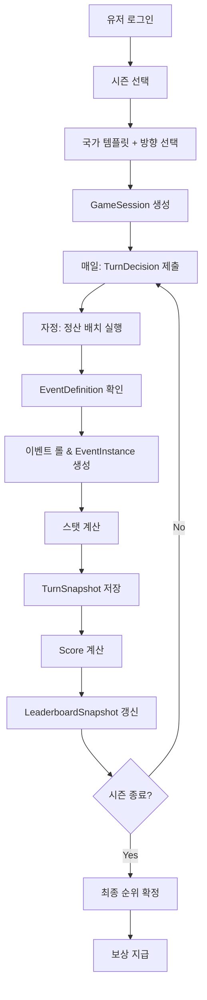

# 데이터 모델 (ERD) v0.2

> World Sim - Mermaid 기반 Entity Relationship Diagram

---

## 0. 문서 메타 및 용어

| 항목 | 내용 |
|------|------|
| 버전 | v0.2 |
| 작성일 | 2024-01-19 |
| 변경 이력 | v0.1 → v0.2: TurnDecision/Snapshot 분리, EventDefinition/Instance, 모더레이션, LeaderboardSnapshot |

### 핵심 용어

| 용어 | 정의 |
|------|------|
| **TurnDecision** | 유저가 턴에 제출하는 입력 (예산, 정책, 외교) |
| **TurnSnapshot** | 정산 후 생성되는 결과 스냅샷 |
| **EventDefinition** | 시스템 정의 이벤트 (어드민 관리) |
| **EventInstance** | 실제 발생한 이벤트 기록 |
| **LeaderboardSnapshot** | 시즌/일자별 리더보드 집계 스냅샷 |
| **NationTemplate** | 국가 시작 템플릿 (초기 스탯) |

---

## 1. ERD 다이어그램 (Mermaid)

```mermaid
erDiagram
    %% Core Game
    User ||--o{ GameSession : plays
    Season ||--o{ GameSession : contains
    NationTemplate ||--o{ GameSession : uses

    GameSession ||--o{ TurnDecision : submits
    GameSession ||--o{ TurnSnapshot : has

    %% Events (Data-Driven)
    EventDefinition ||--o{ EventInstance : triggers
    TurnSnapshot ||--o{ EventInstance : contains

    %% UGC
    User ||--o{ Challenge : creates
    User ||--o{ PolicyDeck : creates
    User ||--o{ MapSeed : creates

    GameSession }o--o| Challenge : plays
    GameSession }o--o| MapSeed : uses

    PolicyDeck ||--o{ PolicyDeckCard : contains
    PolicyCard ||--o{ PolicyDeckCard : included_in

    %% Leaderboard
    Season ||--o{ LeaderboardSnapshot : has
    User ||--o{ LeaderboardSnapshot : ranked_in

    %% Moderation
    User ||--o{ UGCReport : reports
    Challenge ||--o{ UGCReport : receives
    PolicyDeck ||--o{ UGCReport : receives
    UGCReport ||--o{ ModerationAction : results_in

    %% === Entity Definitions ===

    User {
        string id PK "UUID"
        string email UK "이메일"
        string nickname "닉네임 (2-20자)"
        string avatarUrl "아바타 URL"
        string provider "소셜 로그인 제공자"
        datetime createdAt
        datetime updatedAt
    }

    Season {
        string id PK "UUID"
        string name "시즌 이름 (S1, S2...)"
        int number "시즌 번호"
        datetime startDate "시작일"
        datetime endDate "종료일"
        string status "UPCOMING/ACTIVE/ENDED"
        json scoreWeights "Score 가중치"
        json specialRules "시즌 특수 규칙"
    }

    NationTemplate {
        string id PK "예: balanced, industrial"
        string name "템플릿 이름"
        string displayName "표시명 (Team Korea 등)"
        string flagUrl "국기 URL"
        json initialStats "초기 스탯"
    }

    GameSession {
        string id PK "UUID"
        string odUserId FK "User.id"
        string seasonId FK "Season.id"
        string nationTemplateId FK "NationTemplate.id"
        string challengeId FK "Challenge.id (nullable)"
        string mapSeedId FK "MapSeed.id (nullable)"
        string direction "INDUSTRY/FINANCE/MILITARY/TECH"
        json currentStats "현재 스탯 (9개)"
        int currentTurn "현재 턴 번호"
        int totalScore "누적 Score"
        string status "ACTIVE/COMPLETED/ABANDONED"
        datetime createdAt
        datetime updatedAt
    }

    TurnDecision {
        string id PK "UUID"
        string sessionId FK "GameSession.id"
        int turnNumber "턴 번호"
        json budget "예산 배분 (%)"
        json activePolicies "활성 정책 ID 배열"
        json diplomacyActions "외교 행동 배열"
        datetime submittedAt "제출 시각"
    }

    TurnSnapshot {
        string id PK "UUID"
        string sessionId FK "GameSession.id"
        int turnNumber "턴 번호"
        json statsSnapshot "정산 후 스탯"
        int scoreChange "이번 턴 점수 변화"
        int totalScore "누적 Score"
        datetime processedAt "정산 시각"
    }

    EventDefinition {
        string id PK "예: financial-crisis"
        string name "이벤트 이름"
        string category "ECONOMY/MILITARY/TECH/SOCIAL/DIPLOMACY"
        json triggers "트리거 조건"
        json effects "효과 (스탯 변화)"
        int duration "지속 턴 (0=즉시)"
        boolean isActive "활성 여부"
    }

    EventInstance {
        string id PK "UUID"
        string definitionId FK "EventDefinition.id"
        string snapshotId FK "TurnSnapshot.id"
        string sessionId FK "GameSession.id"
        int turnNumber "발생 턴"
        json appliedEffects "적용된 효과"
        int remainingDuration "남은 지속 턴"
    }

    Challenge {
        string id PK "UUID"
        string creatorId FK "User.id"
        string title "챌린지 제목"
        string description "설명"
        string seasonScope "대상 시즌 (nullable)"
        int seed "랜덤 시드"
        string startNationTemplate "시작 국가 템플릿"
        json constraints "제약 조건 배열"
        json winConditions "승리 조건 배열"
        int turnLimit "턴 제한"
        string difficulty "EASY/NORMAL/HARD/EXTREME"
        string status "DRAFT/PUBLISHED/UNDER_REVIEW/HIDDEN/BANNED"
        int playCount "플레이 수"
        int completionCount "완주 수"
        int likeCount "좋아요 수"
        int reportCount "신고 수 (denormalized)"
        boolean isOfficial "공식 챌린지 여부"
        datetime publishedAt "공개일"
        datetime createdAt
    }

    PolicyCard {
        string id PK "예: export-boost"
        string name "카드 이름"
        string category "ECONOMY/WELFARE/TECH/MILITARY/DIPLOMACY/RISK"
        string description "카드 설명"
        json effects "효과 (스탯 변화)"
        json conditions "적용 조건 (nullable)"
        boolean isActive "활성 여부"
    }

    PolicyDeck {
        string id PK "UUID"
        string creatorId FK "User.id"
        string name "덱 이름"
        string description "덱 설명"
        string playstyle "플레이스타일 태그"
        string status "DRAFT/PUBLISHED/UNDER_REVIEW/HIDDEN/BANNED"
        int copyCount "복사 횟수"
        int likeCount "좋아요 수"
        int reportCount "신고 수 (denormalized)"
        datetime publishedAt "공개일"
        datetime createdAt
    }

    PolicyDeckCard {
        string id PK "UUID"
        string deckId FK "PolicyDeck.id"
        string cardId FK "PolicyCard.id"
        int priority "우선순위 (1-8)"
    }

    MapSeed {
        string id PK "UUID"
        string creatorId FK "User.id"
        string name "시드 이름"
        int seed "랜덤 시드"
        string resourceRichness "SCARCE/NORMAL/ABUNDANT"
        float oilBias "석유 편향 (0-1)"
        float mineralBias "광물 편향 (0-1)"
        string tradeAccess "LOW/NORMAL/HIGH"
        string disasterRate "LOW/NORMAL/HIGH"
        string status "DRAFT/PUBLISHED/UNDER_REVIEW/HIDDEN/BANNED"
        int playCount "플레이 수"
        int reportCount "신고 수"
        datetime publishedAt
        datetime createdAt
    }

    LeaderboardSnapshot {
        string id PK "UUID"
        string seasonId FK "Season.id"
        date snapshotDate "스냅샷 날짜"
        string type "DAILY/WEEKLY/SEASON/CATEGORY"
        string category "ALL/ECONOMY/TECH/DIPLOMACY (nullable)"
        json rankings "순위 배열 [{userId, sessionId, score, rank}]"
        int totalPlayers "총 참가자 수"
        datetime createdAt
    }

    UGCReport {
        string id PK "UUID"
        string reporterId FK "User.id"
        string targetType "CHALLENGE/POLICY_DECK/MAP_SEED"
        string targetId "대상 ID"
        string reason "HATE/POLITICS/VIOLENCE/SPAM/OTHER"
        string description "상세 설명"
        string status "PENDING/REVIEWED/DISMISSED/ACTIONED"
        datetime createdAt
    }

    ModerationAction {
        string id PK "UUID"
        string reportId FK "UGCReport.id (nullable)"
        string adminId FK "User.id (어드민)"
        string targetType "CHALLENGE/POLICY_DECK/MAP_SEED/USER"
        string targetId "대상 ID"
        string action "WARN/HIDE/BAN/RESTORE"
        string reason "사유"
        datetime createdAt
    }
```



---

## 2. 관계 정의

### 핵심 관계
| 관계 | 설명 |
|------|------|
| User 1:N GameSession | 유저는 여러 시즌에 참여 |
| Season 1:N GameSession | 시즌은 여러 세션 포함 |
| NationTemplate 1:N GameSession | 템플릿 기반 세션 생성 |
| GameSession 1:N TurnDecision | 세션당 여러 턴 입력 |
| GameSession 1:N TurnSnapshot | 세션당 여러 턴 결과 |

### 이벤트 관계
| 관계 | 설명 |
|------|------|
| EventDefinition 1:N EventInstance | 정의당 여러 발생 기록 |
| TurnSnapshot 1:N EventInstance | 턴 결과에 이벤트 포함 |
| GameSession 1:N EventInstance | 세션에 발생한 이벤트들 |

### UGC 관계
| 관계 | 설명 |
|------|------|
| User 1:N Challenge | 유저가 챌린지 생성 |
| User 1:N PolicyDeck | 유저가 덱 생성 |
| User 1:N MapSeed | 유저가 시드 생성 |
| GameSession N:1 Challenge | 세션이 챌린지 플레이 (optional) |
| PolicyDeck N:N PolicyCard | 덱에 카드 8장 포함 |

### 리더보드/모더레이션
| 관계 | 설명 |
|------|------|
| Season 1:N LeaderboardSnapshot | 시즌별 일일 스냅샷 |
| User 1:N UGCReport | 유저가 신고 제출 |
| UGCReport 1:N ModerationAction | 신고에 대한 제재 |

---

## 3. 주요 제약 및 인덱스

### Unique 제약
```sql
-- 턴 중복 방지
ALTER TABLE TurnDecision ADD CONSTRAINT uq_turndecision
  UNIQUE (sessionId, turnNumber);

ALTER TABLE TurnSnapshot ADD CONSTRAINT uq_turnsnapshot
  UNIQUE (sessionId, turnNumber);

-- 리더보드 스냅샷 중복 방지
ALTER TABLE LeaderboardSnapshot ADD CONSTRAINT uq_leaderboard
  UNIQUE (seasonId, snapshotDate, type, category);

-- 덱 카드 중복 방지
ALTER TABLE PolicyDeckCard ADD CONSTRAINT uq_deckcard
  UNIQUE (deckId, cardId);
```

### 인덱스
```sql
-- 조회 성능
CREATE INDEX idx_session_user ON GameSession(userId);
CREATE INDEX idx_session_season ON GameSession(seasonId);
CREATE INDEX idx_session_status ON GameSession(status);

CREATE INDEX idx_turndecision_session ON TurnDecision(sessionId);
CREATE INDEX idx_turnsnapshot_session ON TurnSnapshot(sessionId);

CREATE INDEX idx_eventinstance_session ON EventInstance(sessionId);
CREATE INDEX idx_eventinstance_definition ON EventInstance(definitionId);

-- UGC 조회
CREATE INDEX idx_challenge_status ON Challenge(status);
CREATE INDEX idx_challenge_creator ON Challenge(creatorId);
CREATE INDEX idx_challenge_official ON Challenge(isOfficial);
CREATE INDEX idx_challenge_published ON Challenge(publishedAt);

CREATE INDEX idx_policydeck_status ON PolicyDeck(status);
CREATE INDEX idx_policydeck_creator ON PolicyDeck(creatorId);

-- 리더보드 조회
CREATE INDEX idx_leaderboard_season_date ON LeaderboardSnapshot(seasonId, snapshotDate);

-- 모더레이션
CREATE INDEX idx_report_status ON UGCReport(status);
CREATE INDEX idx_report_target ON UGCReport(targetType, targetId);
```

---

## 4. Enum 정의

```typescript
// 세션 상태
enum SessionStatus {
  ACTIVE = 'ACTIVE',
  COMPLETED = 'COMPLETED',
  ABANDONED = 'ABANDONED'
}

// 시즌 상태
enum SeasonStatus {
  UPCOMING = 'UPCOMING',
  ACTIVE = 'ACTIVE',
  ENDED = 'ENDED'
}

// 초기 방향
enum Direction {
  INDUSTRY = 'INDUSTRY',
  FINANCE = 'FINANCE',
  MILITARY = 'MILITARY',
  TECH = 'TECH'
}

// 난이도
enum Difficulty {
  EASY = 'EASY',
  NORMAL = 'NORMAL',
  HARD = 'HARD',
  EXTREME = 'EXTREME'
}

// UGC 상태
enum UGCStatus {
  DRAFT = 'DRAFT',
  PUBLISHED = 'PUBLISHED',
  UNDER_REVIEW = 'UNDER_REVIEW',
  HIDDEN = 'HIDDEN',
  BANNED = 'BANNED'
}

// 정책 카테고리
enum PolicyCategory {
  ECONOMY = 'ECONOMY',
  WELFARE = 'WELFARE',
  TECH = 'TECH',
  MILITARY = 'MILITARY',
  DIPLOMACY = 'DIPLOMACY',
  RISK = 'RISK'
}

// 이벤트 카테고리
enum EventCategory {
  ECONOMY = 'ECONOMY',
  MILITARY = 'MILITARY',
  TECH = 'TECH',
  SOCIAL = 'SOCIAL',
  DIPLOMACY = 'DIPLOMACY'
}

// 리더보드 타입
enum LeaderboardType {
  DAILY = 'DAILY',
  WEEKLY = 'WEEKLY',
  SEASON = 'SEASON',
  CATEGORY = 'CATEGORY'
}

// 신고 사유
enum ReportReason {
  HATE = 'HATE',
  POLITICS = 'POLITICS',
  VIOLENCE = 'VIOLENCE',
  SPAM = 'SPAM',
  OTHER = 'OTHER'
}

// 신고 상태
enum ReportStatus {
  PENDING = 'PENDING',
  REVIEWED = 'REVIEWED',
  DISMISSED = 'DISMISSED',
  ACTIONED = 'ACTIONED'
}

// 제재 액션
enum ModerationActionType {
  WARN = 'WARN',
  HIDE = 'HIDE',
  BAN = 'BAN',
  RESTORE = 'RESTORE'
}
```

---

## 5. JSON 필드 스키마

### GameSession.currentStats
```json
{
  "gdp": 300,
  "industry": 30,
  "resource": 50,
  "techLevel": 2,
  "research": 30,
  "military": 50,
  "population": 5000,
  "happiness": 60,
  "diplomacy": 50,
  "internationalTrust": 50
}
```

### TurnDecision.budget
```json
{
  "economy": 30,
  "welfare": 20,
  "research": 20,
  "military": 15,
  "diplomacy": 15
}
```

### TurnDecision.diplomacyActions
```json
[
  { "type": "TRADE", "targetSessionId": "uuid" },
  { "type": "SANCTION", "targetSessionId": "uuid" }
]
```

### EventDefinition.triggers
```json
{
  "conditions": [
    { "stat": "gdp", "operator": ">", "value": 500 },
    { "stat": "happiness", "operator": "<", "value": 40 }
  ],
  "baseProbability": 0.15,
  "policyRequired": null,
  "mapSeedCondition": null
}
```

### LeaderboardSnapshot.rankings
```json
[
  { "rank": 1, "userId": "uuid", "sessionId": "uuid", "score": 1540, "nationTemplate": "balanced" },
  { "rank": 2, "userId": "uuid", "sessionId": "uuid", "score": 1420, "nationTemplate": "industrial" }
]
```

---

## 6. 데이터 흐름



---

## 7. 데이터 보존 정책

| 데이터 | 보존 기간 | 비고 |
|--------|----------|------|
| User | 영구 | 탈퇴 시 익명화 |
| GameSession | 시즌 종료 후 1년 | 요약 통계만 보존 |
| TurnDecision | 시즌 종료 후 3개월 | 이후 삭제 |
| TurnSnapshot | 시즌 종료 후 1년 | 요약 보존 |
| LeaderboardSnapshot | 영구 | 시즌 기록 |
| UGCReport | 영구 | 감사 로그 |
| ModerationAction | 영구 | 감사 로그 |

---

*v0.2 - 2024-01-19 작성*
*변경: TurnDecision/Snapshot 분리, EventDefinition/Instance, 모더레이션 테이블, LeaderboardSnapshot*
